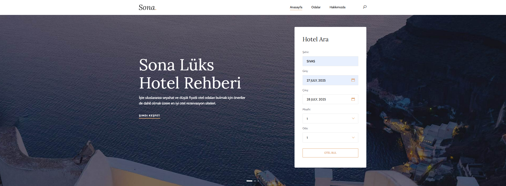

# 🏨 Hotel Finder – ASP.NET Core 8.0 ile Otel Arama Uygulaması

Bu proje, **ASP.NET Core 8.0** kullanılarak geliştirilen ve **RapidAPI Booking.com API** üzerinden gerçek zamanlı otel arama özelliği sunan bir uygulamadır.

## 🚀 Proje Özellikleri

- ✅ Şehir adına göre destinasyon ID çekme
- ✅ Otelleri gerçek zamanlı olarak listeleme
- ✅ Fiyat, adres, puan, erişilebilirlik gibi detaylı bilgiler
- ✅ ViewModel yapısıyla sade ve sürdürülebilir kod
- ✅ Veritabanı olmadan sadece API ile çalışma
- ✅ Responsive kullanıcı arayüzü

## 🔧 Kullanılan Teknolojiler

- ASP.NET Core 8.0
- MVC Pattern
- RapidAPI – Booking.com API
- Newtonsoft.Json (JSON işleme)
- HTML, CSS, Bootstrap

## 🖼️ Ekran Görüntüleri

| Hotel Search | List | Detail Page | Hakkımızda |
|--------------|------|-------------|-------------|
|  |  |  |  |

